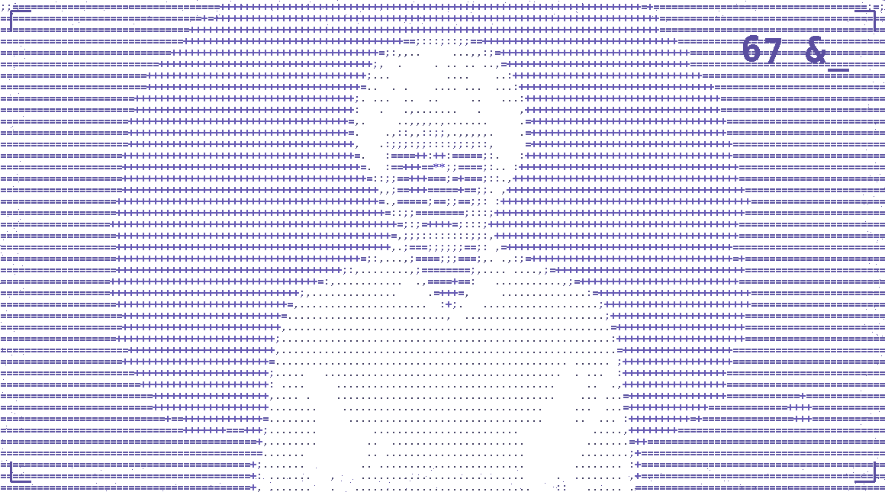
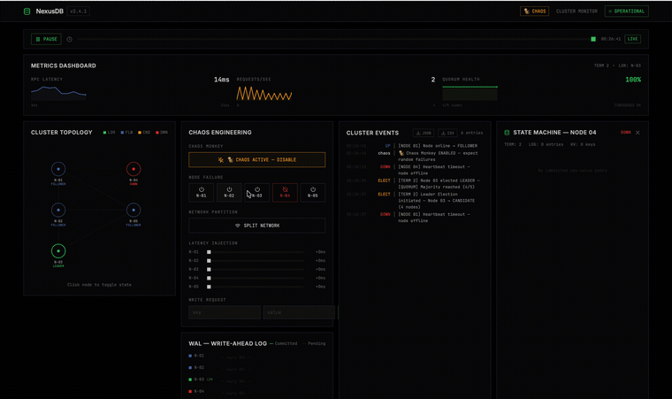
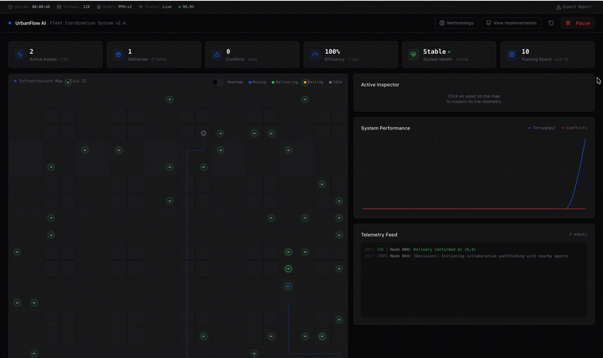

<div align="center">

<picture>
  <source media="(prefers-color-scheme: dark)" srcset="assets/ascii-hi4-dark.gif">
  
</picture>

# Rafael Ibayev
### Systems Engineer · AI Researcher · Builder

[](https://git.io/typing-svg)

<br/>

[](https://www.linkedin.com/in/rafael-ibayev-17889b334/)
[](https://rafael-ibayev-portfolioo.vercel.app)
[](https://maps.google.com/?q=Budapest)

</div>

---

## `> whoami`

```
CS student @ ELTE, Budapest — building distributed systems, MARL, and AI architectures.
Currently: Data Engineer, Bosch (2026 – present) — building data pipelines and
infrastructure for ADAS.
```

---

## `> focus --areas`

<table>
<tr>
<td width="50%">

### 🧠 Artificial Intelligence
- Multi-Agent Reinforcement Learning (MARL)
- RAG systems & LLM architectures
- Computer Vision (YOLO, real-time inference)
- Signal Processing & Bio-Neural interfaces
- ML Pipelines (PyTorch, Scikit-learn)

</td>
<td width="50%">

### ⚙️ Systems & Infrastructure
- Distributed consensus algorithms (Raft)
- Fault-tolerant key-value stores
- Real-time data synchronization
- Containerization & DevOps (Docker, Linux)
- Backend architecture & REST/WebSocket APIs

</td>
</tr>
<tr>
<td width="50%">

### 🌐 Full-Stack Engineering
- React, TypeScript, Vite ecosystems
- Supabase (PostgreSQL, Realtime, Auth)
- WebRTC & real-time collaboration
- Mobile-first, PWA development
- API design & microservices

</td>
<td width="50%">

### 🤖 Robotics & Hardware
- Bio-signal acquisition & processing (EMG)
- Prosthetic control systems
- Sensor fusion & embedded systems
- Real-time motor control algorithms
- Human-machine interface design

</td>
</tr>
</table>

---

## `> cat tech_stack.json`

<div align="center">

**Languages**


**AI / ML**


**Frontend & Backend**


**Infrastructure**


</div>

---

## `> ls -la ./projects`

<table width="100%">
<tr>
<td width="50%" valign="top">

<br/>


### 🔴 NexusDB
**Distributed Key-Value Store**


Leader Election · Log Replication · Chaos Engineering · Automatic Failover (1.5–3s)

```
Go  Java  gRPC
Raft Consensus  Distributed Systems
```

[](https://raft-overseer.vercel.app)

</td>
<td width="50%" valign="top">

<br/>


### 🔵 UrbanFlow AI
**Autonomous Logistics Simulator**


Neural Path Planning · Reward Shaping · Emergent Cooperation, Zero Collisions

```
Python  PyTorch  MARL
Custom Environment  Visualization
```

[](https://urbanflow-command.vercel.app)

</td>
</tr>

<tr><td colspan="2"><br/></td></tr>

<tr>
<td width="50%" valign="top">

<br/>

<div align="center">

### 🟣 UniFlow
**Student Operating System**

*Replace 7 apps with one.*


</div>

RAG AI Tutor · Knowledge Vault · Live Whiteboards · Kanban · Forums

```
React  TypeScript  Supabase
WebRTC  Groq API  Framer Motion
```

[](https://uniflow-campus-hub.vercel.app)

</td>
<td width="50%" valign="top">

<br/>

<div align="center">

### 🟠 ORATOR
**AI Speech Coach**

*Real-time analysis of your speaking.*


</div>

Pace · Filler Words · Tonal Variation · Confidence Scoring

```
Python  Azure AI Speech  React
Custom NLP  Real-time Analytics
```

[](https://orator-99.vercel.app)

</td>
</tr>

<tr><td colspan="2"><br/></td></tr>

<tr>
<td colspan="2">

<br/>

<div align="center">

### 🟢 Bio-Signal Robotic Prosthesis
**EMG-Controlled Prosthetic Hand**


</div>

<br/>

<table width="100%">
<tr>
<td align="center" width="25%"><b>94%+</b><br/><sub>Gesture Accuracy</sub></td>
<td align="center" width="25%"><b>Real-time</b><br/><sub>Signal Processing</sub></td>
<td align="center" width="25%"><b>Bandpass + Notch</b><br/><sub>Noise Filtering</sub></td>
<td align="center" width="25%"><b>Live Demo</b><br/><sub>Validated</sub></td>
</tr>
</table>

<br/>

```
Python  C  EMG Acquisition  Signal Processing  Embedded Systems  ML Classification
```

[](https://github.com/falafell99/robotic-arm)

</td>
</tr>
</table>

<br/>

---

## `> cat experience.log`

<table width="100%">
<tr>
<td>

### Data Engineer · Bosch
`2026 — present`

Building data pipelines and infrastructure for ADAS (Advanced Driver-Assistance Systems).
Working with large-scale automotive sensor data, designing ingestion and transformation
pipelines that feed downstream ML and validation systems.

**Scope**
- Designing and maintaining ETL pipelines for ADAS sensor/telemetry data
- Building data infrastructure to support ML model validation at scale
- Collaborating with cross-functional automotive engineering teams

`Python` `SQL` `Data Pipelines` `ADAS` `ETL`

</td>
</tr>
</table>

---

## `> cat awards.log`

<div align="center">


</div>

<br/>

<div align="center">


</div>

---

## `> cat certifications.log`

```
[ in progress — currently completing coursework, will list here once issued ]
```

---

## `> cat coding_profiles.json`

<div align="center">

[](https://leetcode.com/falafell99/)

</div>

---

## `> github --stats`

<div align="center">

<picture>
  <source media="(prefers-color-scheme: dark)" srcset="https://github-readme-stats.vercel.app/api?username=falafell99&show_icons=true&theme=tokyonight&hide_border=true&bg_color=0d1117&title_color=7b68ee&icon_color=7b68ee&text_color=c9d1d9&rank_icon=github&cache_seconds=86400">
  
</picture>
<picture>
  <source media="(prefers-color-scheme: dark)" srcset="https://github-readme-stats.vercel.app/api/top-langs/?username=falafell99&layout=compact&theme=tokyonight&hide_border=true&bg_color=0d1117&title_color=7b68ee&text_color=c9d1d9&langs_count=8&cache_seconds=86400">
  
</picture>

<br/>

<picture>
  <source media="(prefers-color-scheme: dark)" srcset="https://github-readme-streak-stats.herokuapp.com/?user=falafell99&theme=tokyonight&hide_border=true&background=0d1117&stroke=7b68ee&ring=7b68ee&fire=7b68ee&currStreakLabel=7b68ee&sideLabels=c9d1d9&currStreakNum=c9d1d9&sideNums=c9d1d9&dates=c9d1d9">
  
</picture>

</div>

<br/>

<div align="center">

<picture>
  <source media="(prefers-color-scheme: dark)" srcset="https://github-profile-trophy.vercel.app/?username=falafell99&theme=algolia&no-frame=true&no-bg=true&margin-w=8&margin-h=8&column=7">
  
</picture>

</div>

---

## `> cat contributions.snake`

<div align="center">

<picture>
  <source media="(prefers-color-scheme: dark)" srcset="https://raw.githubusercontent.com/falafell99/falafell99/output/github-contribution-grid-snake-dark.svg">
  
</picture>

</div>

> Snake animates weekly from your real contribution graph — see setup note below.

---

[](https://www.linkedin.com/in/rafael-ibayev-17889b334/)
[](https://rafael-ibayev-portfolioo.vercel.app)

<br/>


</div>
